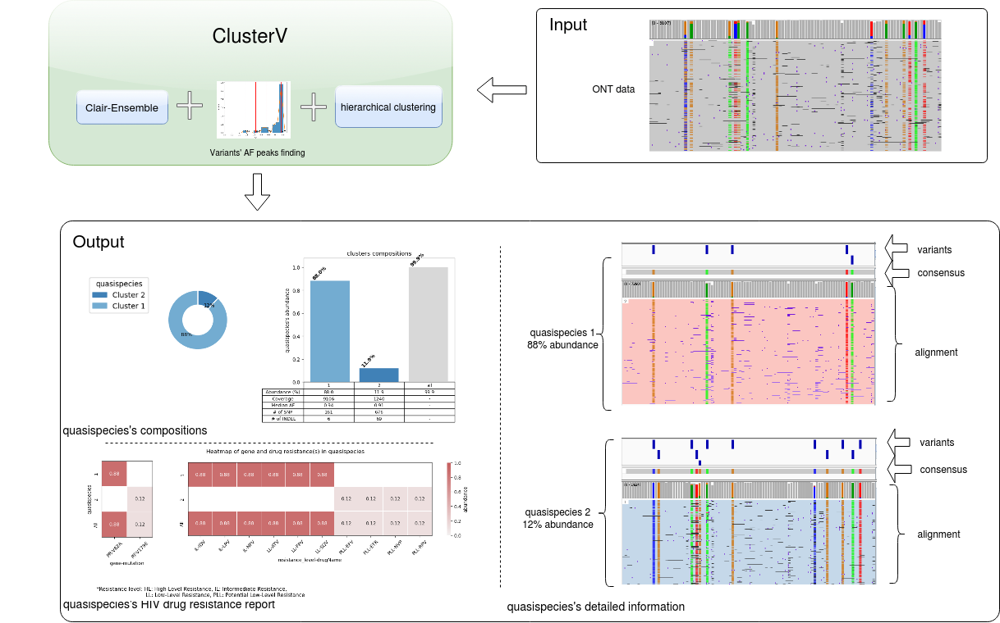

# ClusterV: finding HIV subtypes from ONT sequencing data

[](https://opensource.org/licenses/BSD-3-Clause) 
[](https://www.docker.com/)
[](https://nanoporetech.com/)


Contact: Ruibang Luo, Junhao Su  
Email: rbluo@cs.hku.hk, jhsu@cs.hku.hk  

----

## Introduction
ClusterV is a standalone pipeline for accurately identifying HIV subtypes from ONT sequencing data.  ClusterV takes the alignment BAM file, reference FastA file and target region BED file (defining the target regions) of the HIV data as input, and outputs all found subtypes with their abundance, alignment, variants (SNPs and INDELs), and the drug resistance reports. ClusterV consists of three major modules, 1) filtering and initialing, where we run quality control at alignment files; 2) subtypes finding, we iteratively run variant calling - hierarchical clustering to find all variants and subtypes; 3) HIV mutation finding, where we generate consensus from each subtype and get all HIV drug resistance mutations reports. 



---

## Contents

* [Introduction](#introduction)
* [Installation](#installation)
  + [Option 1. Docker pre-built image](#option-1-docker-pre-built-image)
  + [Option 2. Build an anaconda virtual environment](#option-2-build-an-anaconda-virtual-environment)
  + [Option 3. Docker Dockerfile](#option-2-docker-dockerfile)
* [Usage](#usage)
  + [Parameters](/docs/options.md)
  + [Understand output files](/docs/output.md)
* [Quick demo](#quick-demo)
* [Using localized HIVdb](#using-localized-hivdb)
* [Acknowledgement](#acknowledgement)

## Installation

### Option 1. Docker pre-built image
A pre-built docker image is available [here](https://hub.docker.com/repository/docker/hkubal/clusterv). With it you can run ClusterV using a single command.

Caution: Absolute path is needed for both `INPUT_DIR` and `OUTPUT_DIR`.

```
INPUT_DIR=`pwd`                                     # input path, e.g. /input
INPUT_REF=${INPUT_DIR}/HIV_1.fasta                  # change your reference file name here
INPUT_BED=${INPUT_DIR}/HIV_1_amplicon_region.bed    # change your bed file name here
INPUT_BAM=${INPUT_DIR}/mix_ds.bam                   # change your bam file name here
SAMPLE_ID="mix_ds"                                  # change your sample ID here
OUTPUT_DIR=`pwd`/out                                # output path, e.g. /output
THREADS=48                                          # threads, e.g. 48

docker run -it \
  -v ${INPUT_DIR}:${INPUT_DIR} \
  -v ${OUTPUT_DIR}:${OUTPUT_DIR} \
  hkubal/clusterv:latest \
  python /opt/bin/ClusterV/cv.py ClusterV \
  --ref_fn ${INPUT_REF} \
  --bed_fn ${INPUT_BED} \
  --bam_fn ${INPUT_BAM} \
  --sample_id ${SAMPLE_ID} \
  --out_dir ${OUTPUT_DIR} \
  --threads ${THREADS}
```

### Option 2. Build an anaconda virtual environment

```
# get ClusterV code
git clone https://github.com/HKU-BAL/ClusterV.git
cd ClusterV

# create env
conda env create -f clusterV.yml
conda activate clusterV 

pypy3 -m ensurepip
pypy3 -m pip install --no-cache-dir intervaltree==3.0.2

# run ClusterV
python cv.py ClusterV --help
```

### Option 3. Docker Dockerfiles
Building a docker image.

```
# clone ClusterV
git clone https://github.com/hku-bal/ClusterV.git
cd ClusterV

# build a docker image named hkubal/ClusterV:latest
# might require docker authentication to build docker image 
docker build -f ./Dockerfile -t hkubal/clusterv:latest .

# run ClusterV docker image like 
docker run -it hkubal/clusterv:latest python /opt/bin/ClusterV/cv.py --help
```

## Usage

For more parameters setting, please check the [parameters page](/docs/options.md).

For understanding the output files, please check the [output page](/docs/output.md).

Make sure you are in the clusterV environment by using `conda activate clusterV`, when using conda environment.

```bash
CV_DIR="{ClusterV repo path}"
INPUT_BAM="{YOUR_INPUT_BAM}"        # Input BAM file
INPUT_REF="{YOUR_INPUT_FASTA}"      # Input reference Fasta file
INPUT_BED="{YOUR_INPUT_BED}"        # Input BED file for defining the target region
SAMPLE_ID="{YOUR_SAMPLE_ID}"        # Sample ID
OUTPUT_DIR="{YOUR_OUTPUT_DIR}"      # Output path

python ${CV_DIR}/cv.py ClusterV \
 --bam_fn ${INPUT_BAM} \
 --ref_fn ${INPUT_REF} \
 --bed_fn ${INPUT_BED} \
 --sample_id ${SAMPLE_ID} \
 --out_dir ${OUTPUT_DIR}
```


## Quick demo

Make sure you are in the clusterV environment by using `conda activate clusterV`, when using conda environment.

```
# step 1, download testing files
cd ClusterV
mkdir -p testing
(cd testing && wget http://www.bio8.cs.hku.hk/ClusterV/clusterv_testing.tar.gz && tar -xf clusterv_testing.tar.gz && rm clusterv_testing.tar.gz )

# step 2, run testing
TESTING_DIR=`pwd`/testing
INPUT_REF=${TESTING_DIR}/HIV_1.fasta
INPUT_BED=${TESTING_DIR}/HIV_1_amplicon_region.bed
INPUT_BAM=${TESTING_DIR}/mix_ds.bam
SAMPLE_ID="mix_ds"
OUTPUT_DIR=${TESTING_DIR}/out
CV_DIR=`pwd`

python ${CV_DIR}/cv.py ClusterV \
--bam_fn ${INPUT_BAM} \
--ref_fn ${INPUT_REF} \
--bed_fn ${INPUT_BED} \
--sample_id ${SAMPLE_ID} \
--out_dir ${OUTPUT_DIR}
```

## Using localized HIVdb

ClusterV uses online API to query drug resistance mutations in default. 

If you wish to use the [localized HIVdb](https://github.com/hivdb/sierra#start-sierra-with-docker) for HIV drug resistance mutation detection, please launch the HIVdb's [Sierra](https://github.com/hivdb/sierra#start-sierra-with-docker) web service locally, and use the following setting to run the ClusterV program.

```
# Step 1, Start Sierra in local, as instructed in https://github.com/hivdb/sierra#start-sierra-with-docker.
docker pull hivdb/sierra:latest
docker run -it --publish=8111:8080 hivdb/sierra dev

# Step 2, Run ClusterV with addtional "--hivdb_url" setting.
python ${CV_DIR}/cv.py ClusterV \
--hivdb_url http://localhost:8111/sierra/rest/graphql \
--bam_fn ${INPUT_BAM} \
--ref_fn ${INPUT_REF} \
--bed_fn ${INPUT_BED} \
--sample_id ${SAMPLE_ID} \
--out_dir ${OUTPUT_DIR}
```

## Acknowledgement

ClusterV is designed and built by HKUCS BAL lab (HKUCS Bioinformatics Algorithm Lab).

We apply and thank the following tools during the development of ClusterV:

- [HIVdb](https://hivdb.stanford.edu/)
- [IGV](https://software.broadinstitute.org/software/igv/)
- [Flye](https://github.com/fenderglass/Flye)
- [minimap2](https://github.com/lh3/minimap2)
- [parallel](https://manpages.ubuntu.com/manpages/impish/man1/parallel.1.html)


